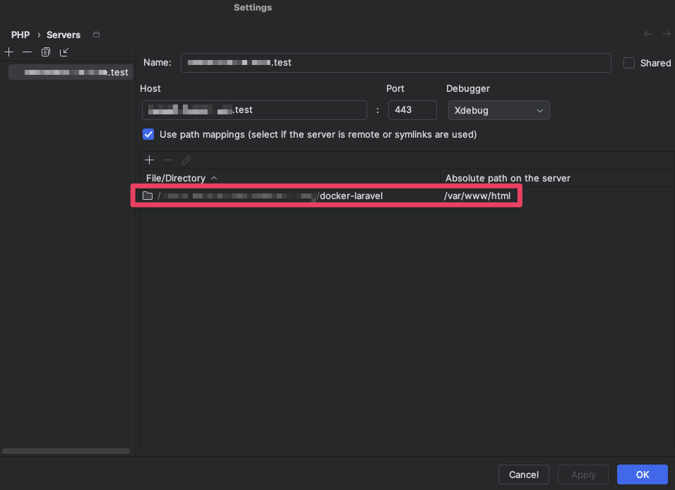

# Docker Development Docs

As a minimal starter, this is likely to require scaling during dev ([YAGNI](https://martinfowler.com/bliki/Yagni.html) for now). [Laravel Sail](https://github.com/laravel/sail) and [the official Docker samples](https://github.com/dockersamples/laravel-docker-examples/blob/main/docker/common/php-fpm/Dockerfile) may supply `Dockerfile` guidance when requiring further Laravel-specific server capabilities.

## 🔑 Getting Started

The following only needs to be completed when you're setting up the project for the first time. Afterwards, simply (re-)start all required services and containers using the relevant command in [Docker Up](#-docker-up) below.

#### 1. Basic prep

- Create the .env file with `cp .env.example .env` and set required values
- Create a Docker-specific .env file with `cp docker/.env.docker.example docker/.env.docker` and set required values

> NOTE `DB_HOST` / `POSTGRES_HOST` have been set to the Postgres Docker service name: `postgres-service`, which will resolve automatically via Docker's DNS, but you'll have to ensure database name, user and password variables are also set appropriately.

#### 2. Enable HTTPS for local development

- To get https working with a self-signed certificate, we'll use [mkcert](https://github.com/FiloSottile/mkcert):
```shell
# Install mkcert if needed (@link https://github.com/FiloSottile/mkcert)
brew install mkcert
brew install nss # if you use Firefox

# Create root CA (see in Keychain Access app: System > Certificates)
mkcert -install

# Create specific certs
mkcert \
-key-file docker/nginx/certs/tab-groups-saver-test-key.pem \
-cert-file docker/nginx/certs/tab-groups-saver-test-cert.pem \
tab-groups-saver.test
```

- Add the following to your `/etc/hosts` file:
```
127.0.0.1 tab-groups-saver.test
```

#### 3. Start Docker Containers

- Run the relevant command in [Docker Up](#-docker-up) below.

#### 4. PHP container commands

- Install dependencies
    - `docker exec $(docker-compose ps -q php-service) composer install`
- Set the APP_KEY
    - `docker exec $(docker-compose ps -q php-service) php artisan key:generate`
- Run DB migrations
    - `docker exec $(docker-compose ps -q php-service) php artisan migrate`

## 🐳 Docker Up

```shell
# dev (utilizes docker compose override) 
docker compose --env-file docker/.env.docker up

# prod
docker compose -f docker-compose.yml -f docker-compose.prod.yml --env-file docker/.env.docker up
```

## 🐞 xDebug

#### Enable in dev

To start the dev container with xDebug enabled (it's disabled by default), ensure the following is in the `.env.docker`:

```
XDEBUG_MODE=debug
```

#### In PhpStorm

- In Settings > PHP, ensure the Debug port matches the port in set in `./docker/php/conf.d/xdebug.ini`
- In Settings > PHP > Servers, ensure the local app directory is mapped to `/var/www/html`, as per the docker set-up.
  

## 🌲 .env Fun

We are not using the `env_file` option in `docker-compose.yml`, because mixing `env_file` and `environment` can lead to confusing overrides. You can use `env_file` alone, but being explicit with `environment` makes it easy to see which variables each service depends on.

The `docker-compose.yml` therefore uses the `environment` key, with values coming from the `.env.docker` file. This keeps configuration values centralized in one place while still making dependencies visible in the Docker Compose file.

We separate Docker .env files from Laravel .env files on purpose. By the time Laravel runs, the environment variables provided by Docker are already available at the system level inside the container (you can confirm this by inspecting the container).

To inspect which Laravel .env values are present, run the following inside the php-service container:

```shell
php artisan tinker

# Now inside Tinker, view all Laravel-specific .env vars with:
Dotenv\Dotenv::createArrayBacked(base_path())->load();
```

## 🎁 Production Considerations

Currently, this is dev-focused and would require further work to make prod-ready. At scale, production deployment usually moves beyond Docker Compose toward orchestrators.

## 👨🏻‍🔧 Troubleshooting

- xDebug doesn't work with PhpStorm's test runner
    - Right-click on either the test runner icon beside a test or a test directory and select "Modify Run Configuration..." > Click the directory icon in the "Environment variables" input > select the `/docker/.env.docker` file.
      - Might require dot files to be shown in the 'open' dialog, `shift+cmd+.` on macOS.
